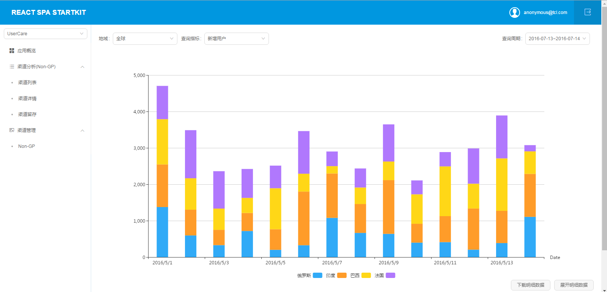

# 基于React+Redux的开发工程模板

## 项目依赖
* [lodash][1] [classnames][2] [querystring][3] [echarts][4]
* [react][5] [react-redux][6] [react-router][7] [react-router-redux][8] [react-dom][9] [antd][10]
* [redux][11] [redux-promise][12] [redux-actions][13]

## 构建项目

```bash
git clone https://github.com/TCL-MIG-FE/react-web-spa-startkit.git
cd react-web-spa-startkit && npm install
```

```bash
npm run start           # 开发环境自动编译并开启mock服务
npm run build           # 打包到static目录,同时在上级文件夹中生成index.jsp,支持J2EE应用上下文
```

## 截图



## 目录结构
    │  package.json              # 配置管理
    │  proxy.js                  # 代理配置
    │  webpack.config.js         # webpack配置文件，根据环境变量来加载开发或者产品模式配置文件
    │  webpack.dev.config.js     # webpack开发模式配置文件
    │  webpack.prod.config.js    # webpack产品模式配置文件
    ├─mock-server                # 模拟服务器
    │  └─api.json                # 模拟数据
    └─src                        # 源码目录
       ├─actions                 # actions
       ├─components              # react组件
       ├─constants              # 全局变量和配置
       ├─containers             # 各个路由的入口页面
       │  ├─App                 # 父级模版，所有页面公用
       │  ├─AppSummary
       │  ├─ChannelDetails
       │  ├─ChannelManagement
       │  └─ChannelRetention
       ├─layouts                # 通用样式和字体
       │  ├─css
       │  └─fonts
       ├─middleware             # 中间件
       ├─reducers               # reducers
       ├─store                  # 唯一的store
       ├─utils                  # 工具方法
       ├─index.jsp              # 入口jsp模板,webpack会把编译后的脚本和样式注入进去，然后编译到../index.jsp
       ├─root.js                # 应用入口
       └─routes.js              # 路由


## 说明
* **resources文件夹一般放在J2EE工程的webapp目录，与WEB-INF,index.jsp等同级。**
* 打包后会把三方依赖合并为vendors_{date}.js，需要调整请修改webpack.config.js中的entry -> vendors，并同时修改vendor日期。由于vendor一般不会发生变化，发生变化后请修改。
* layouts中的css/less非模块化，使用时直接写样式名，container/components中的按模块方式使用
* 图标样式，glyphicon是bootstrap的图标；icon是[iconfont][16]图标
* mock-server端口默认2618，webpack-dev-server默认端口3000，可以在package.json里修改

[1]: https://www.npmjs.com/package/lodash
[2]: https://www.npmjs.com/package/classnames
[3]: https://www.npmjs.com/package/querystring
[4]: https://www.npmjs.com/package/echarts
[5]: https://www.npmjs.com/package/react
[6]: https://www.npmjs.com/package/react-redux
[7]: https://www.npmjs.com/package/react-router
[8]: https://www.npmjs.com/package/react-router-redux
[9]: https://www.npmjs.com/package/react-dom
[10]: https://github.com/ant-design/ant-design
[11]: https://www.npmjs.com/package/redux
[12]: https://github.com/acdlite/redux-promise
[13]: https://www.npmjs.com/package/redux-actions
